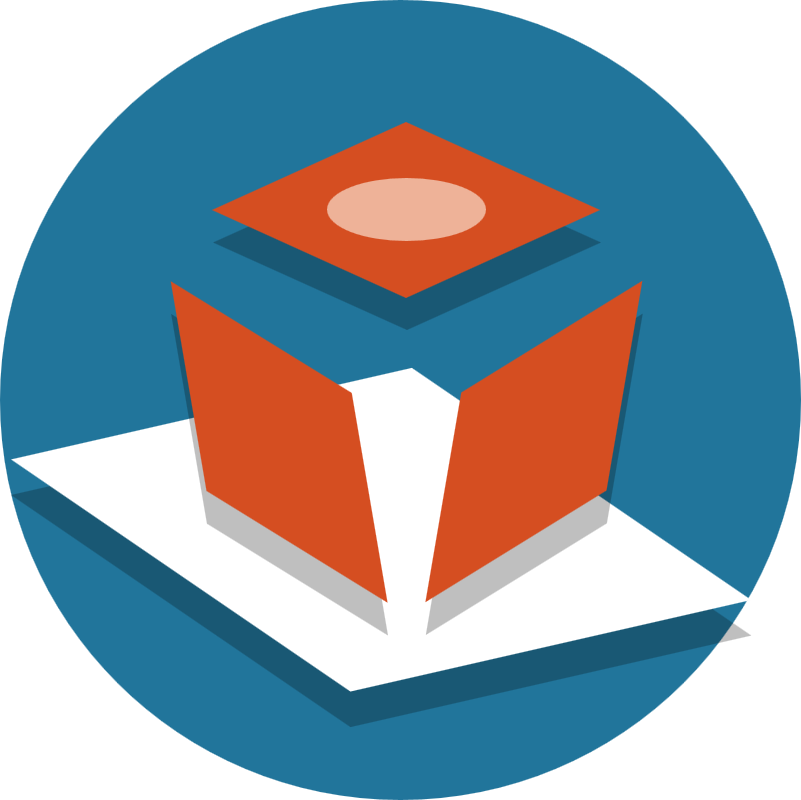
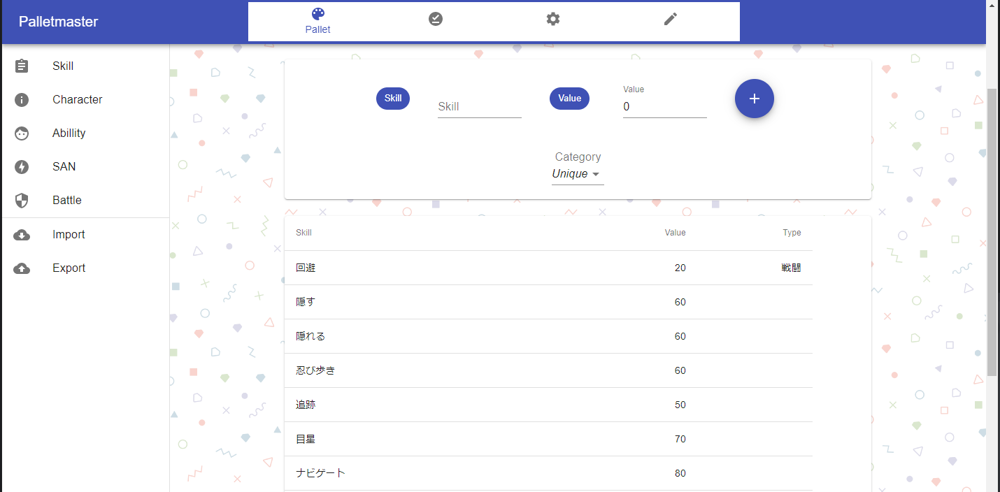
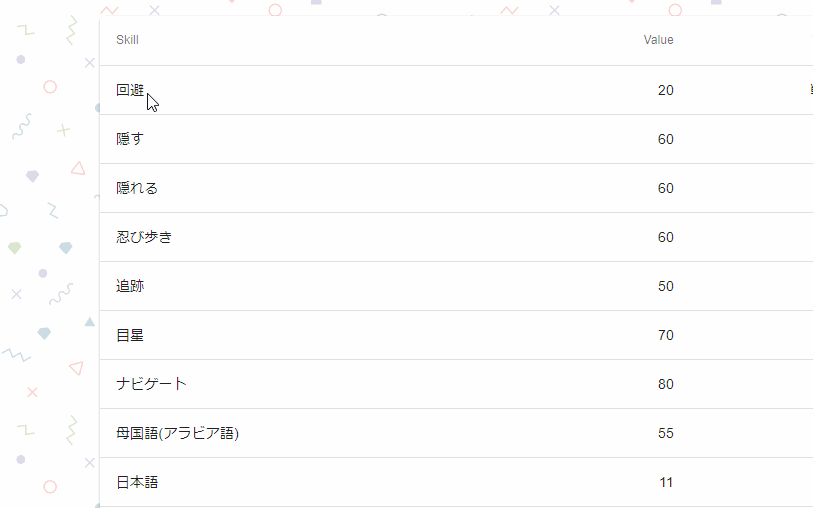
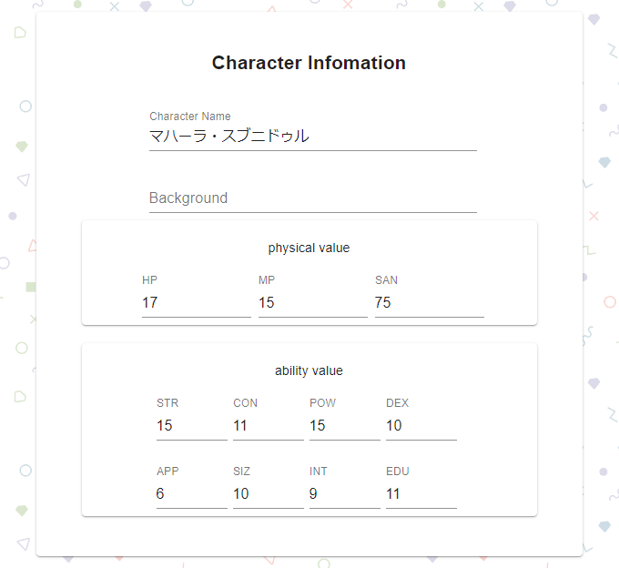
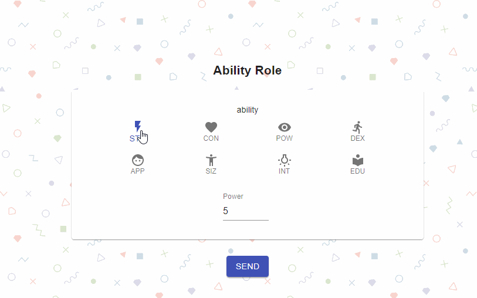
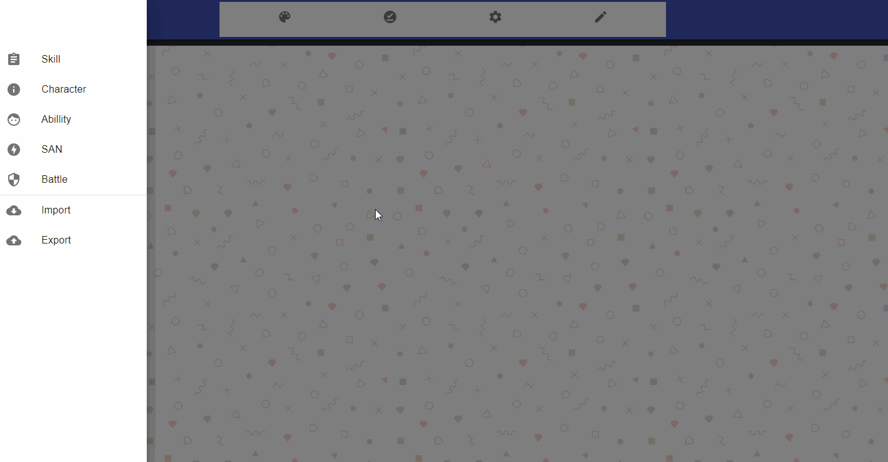
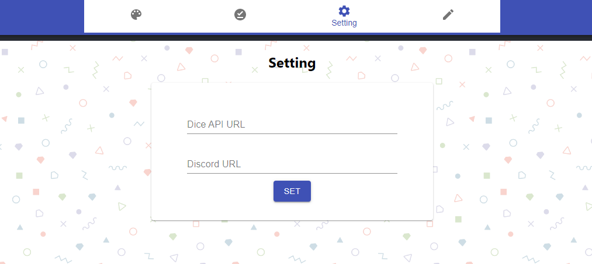
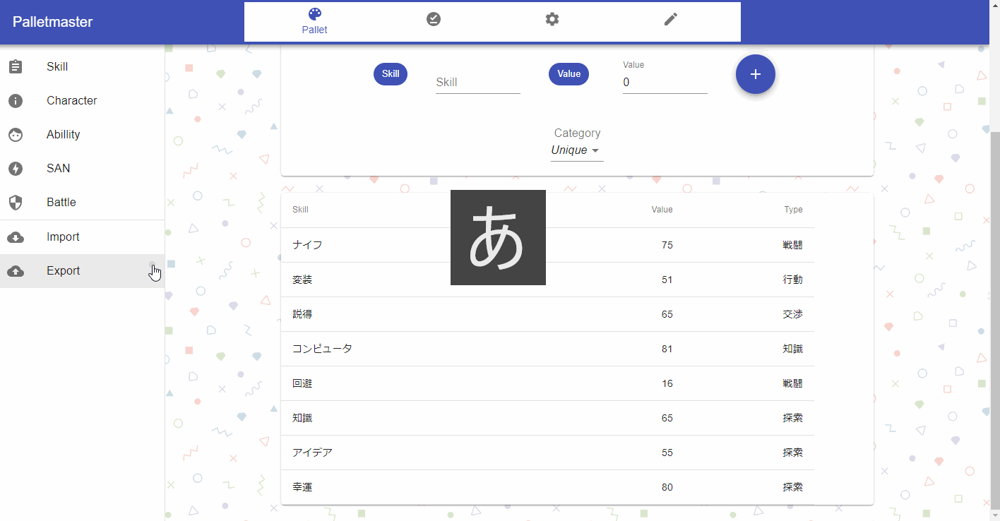

# PalletMaster

クトゥルフの呼び声TRPGセッションを補助するWEBアプリです。
オフラインもしくはDiscord上でセッションを行う際に、プレイヤー(PL)のキャラクター情報を管理、技能ロールを補助し、よりロールプレイに集中することができるようにすることを目的にしています。

## Description

本アプリを使用することで、オフラインもしくはDiscord上でセッションを行う際に下記のことができます。
- キャラクター情報管理
    - 能力値
    - 技能値
    - SAN管理
    - HP,MP管理
    - バックグラウンド
- キャラクターロール
    - 技能ロール
    - 能力値ロール
    - アイデアロール
- キャラクター作成

特に、Discordと連携することで、ロール結果をDiscord上に表示することも可能です。

## Demo
キャラクターの技能は下記のフォームで管理できます。

技能をクリックすることにより、技能ロールの結果を表示することができます。

キャラクター情報は下記のフォームで管理できます。

能力値ロールは下記ページにて、実行することができます。

## Feature
- ディスコードのみで簡単にセッションが行えるようになります
- キャラクターの作成から運用まで一つのアプリで完結させることができます

## Usage
[PalletMaster](https://pm-offline.web.app/home)
上記のWEBサイトにアクセスの後、下記GIFファイルの通りにキャラクター作成を行うことでアプリを使用することができます。

Discordとの連携は、Settingタブの
- Dice API URLには、BCDice-API サーバのURL
- Discord URLには、あなたのDiscord上に作成したWebhookのURL
を入力することによって連携することができます

作成したキャラクターはローカルにダウンロードすることができます。

## Licence

[MIT](https://github.com/tcnksm/tool/blob/master/LICENCE)

## Author

[Logta](https://github.com/Logta)